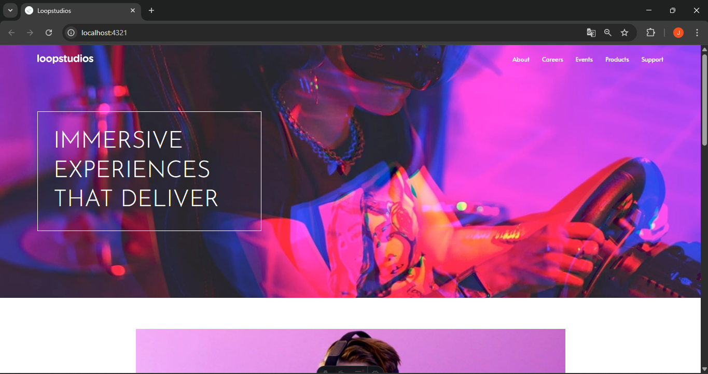
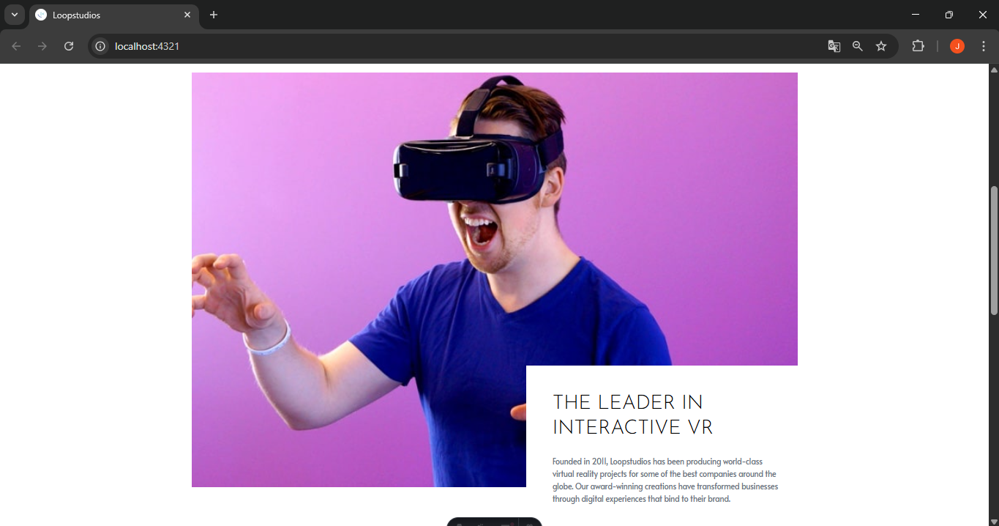
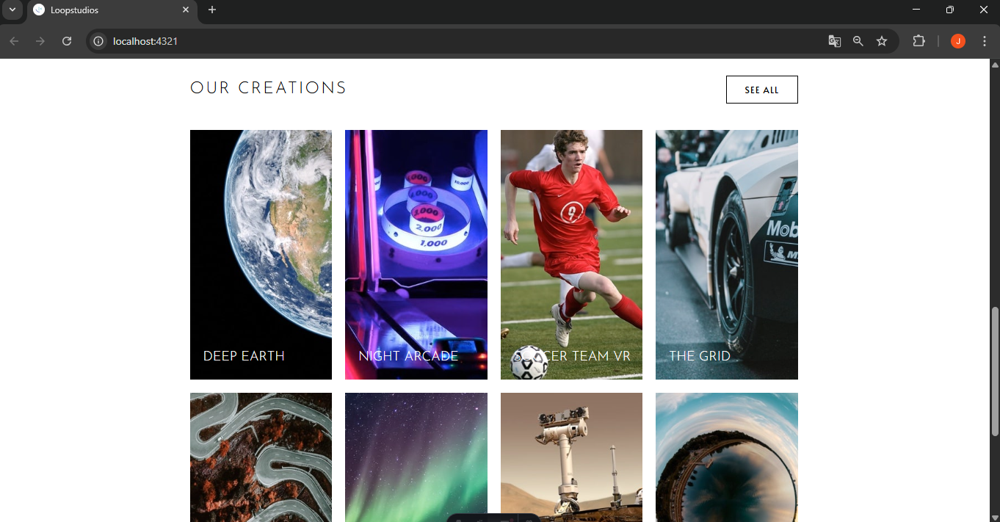
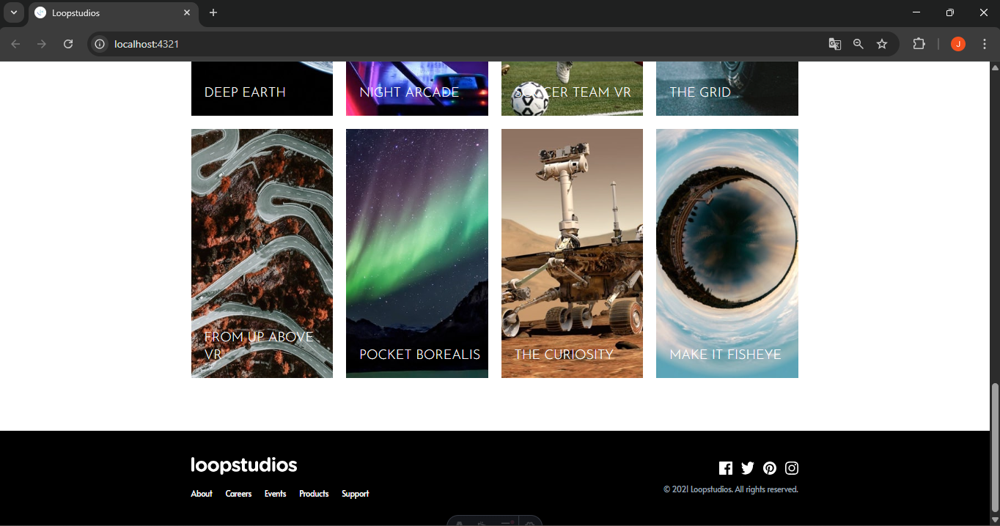

# 🏝️ Proyecto: Loopstudios Landing Page

Este proyecto consiste en el desarrollo de la **landing page de Loopstudios** utilizando **Astro** y **Tailwind CSS**.  
El objetivo es aplicar los conocimientos sobre **componentes de Astro**, **maquetación**, **estilos responsivos** y **utilidades CSS** para construir un diseño limpio, moderno y adaptable a diferentes dispositivos.

---

## 📖 Descripción general

### 🧩 Vista previa del proyecto 






---

### 🔗 Enlaces del proyecto

- **Repositorio en GitHub:** (https://github.com/Jaqui0306/-Loopstudios_Landing_Page/upload)
- **Sitio desplegado (opcional):** (https://loopstudios-tau-five.vercel.app/)

---

## 🧠 Proceso de desarrollo

### 🛠️ Tecnologías utilizadas
Durante el desarrollo del proyecto se utilizaron las siguientes tecnologías y herramientas:

- Astro – Framework moderno para construir sitios web rápidos.
- Tailwind CSS – Framework de estilos basado en utilidades.
- HTML5 semántico – Para estructurar correctamente la página.
- JavaScript – Para el funcionamiento del menú móvil.
- Diseño responsivo (Mobile First) – Adaptación del sitio para móviles y escritorio.
- Componentes reutilizables de Astro – Para organizar mejor el código.

---

### 💡 Lo que aprendí
Durante este proyecto reforcé varios conceptos importantes del desarrollo web. Aprendí a trabajar con Astro y sus componentes, lo que permite dividir la página en partes reutilizables como el header, hero, secciones de contenido y footer. También practiqué el uso de Tailwind CSS, que facilita aplicar estilos rápidamente mediante clases utilitarias sin necesidad de escribir mucho CSS personalizado. Además, aprendí a implementar diseño responsivo, adaptando las imágenes y el diseño para que funcionen correctamente tanto en dispositivos móviles como en pantallas de escritorio.

Un ejemplo de código utilizado en el proyecto es el siguiente:
```html
<header class="flex items-center justify-between p-6 text-white absolute w-full">
  
</header>
```
```css
.text-primary {
  color: hsl(0, 0%, 100%);
}
```
```js
const toggleMenu = () => {
  document.getElementById('menu').classList.toggle('hidden');
}
```
---

### 🚀 Áreas de mejora

- Mejorar la organización del código en los componentes.
- Agregar animaciones o transiciones para mejorar la experiencia del usuario.
- Optimizar las imágenes para mejorar el rendimiento del sitio.
- Explorar más funcionalidades de Astro para proyectos más complejos.

---

### 📚 Recursos útiles
Estos recursos fueron útiles durante el desarrollo del proyecto:

- https://docs.astro.build
- https://tailwindcss.com/docs
- https://developer.mozilla.org/es/
- https://web.dev/responsive-web-design-basics/

---

### 👩‍💻 Autor

- **Nombre completo: Juana Jaqueline Zavala Guzman**  
- **Carrera: TIC's**  
- **Grupo: 6A**  
- **Correo institucional: 23151266@aguascalientes.tecnm.mx**  

---

### ✨ Reflexión final

El desarrollo de este proyecto fue una buena práctica para aplicar conocimientos de maquetación web, diseño responsivo y uso de frameworks modernos. Una de las partes más fáciles fue trabajar con Tailwind CSS, ya que permite aplicar estilos rápidamente mediante clases. Una de las partes más desafiantes fue adaptar el diseño para que se viera correctamente en dispositivos móviles y escritorio, especialmente al manejar diferentes tamaños de imágenes y layouts. La parte que más disfruté fue ver cómo el diseño se iba construyendo paso a paso hasta parecerse al diseño original. En futuros proyectos, puedo aplicar lo aprendido para crear interfaces más complejas, optimizadas y con mejor experiencia de usuario.

